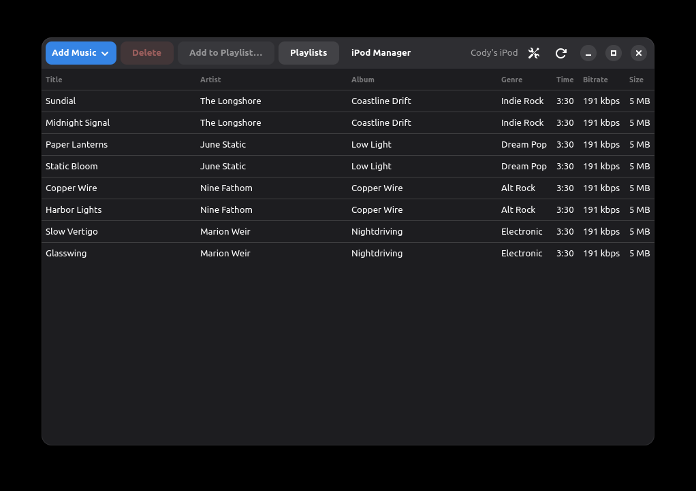
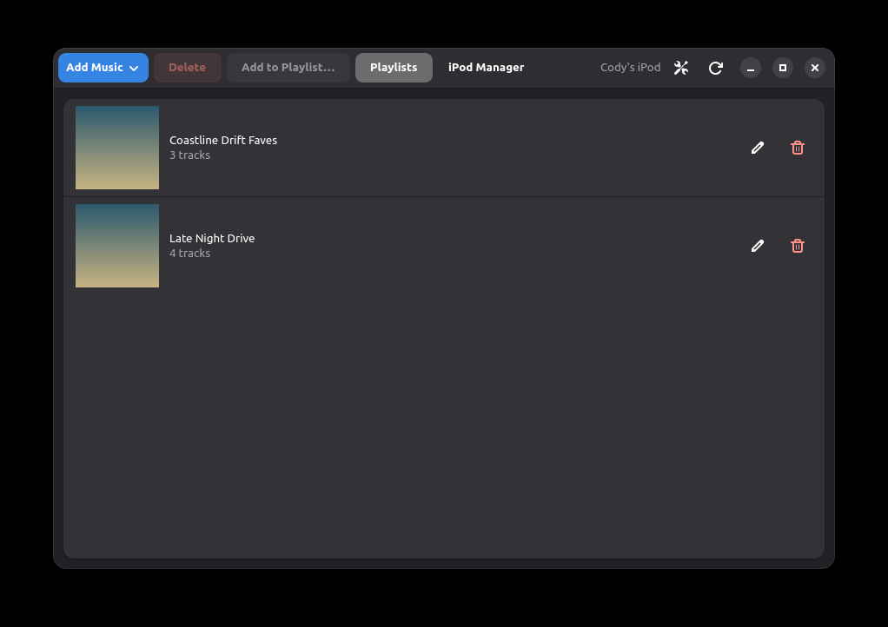
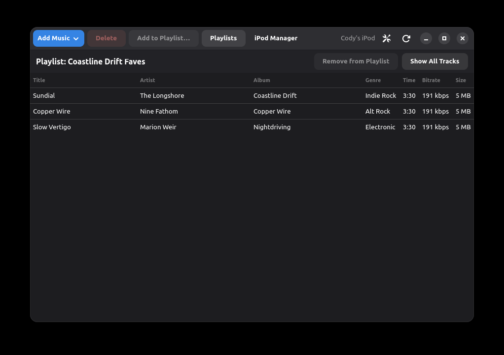
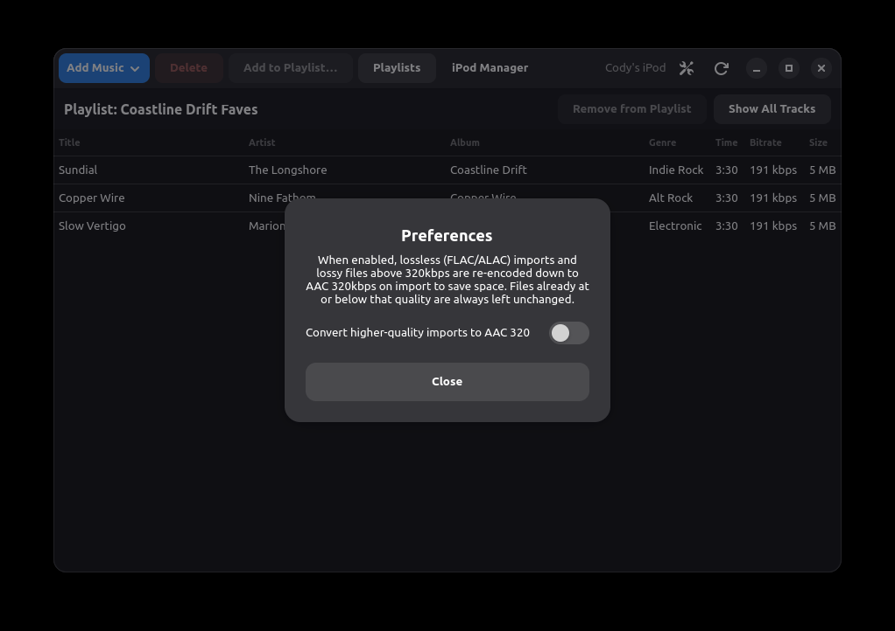
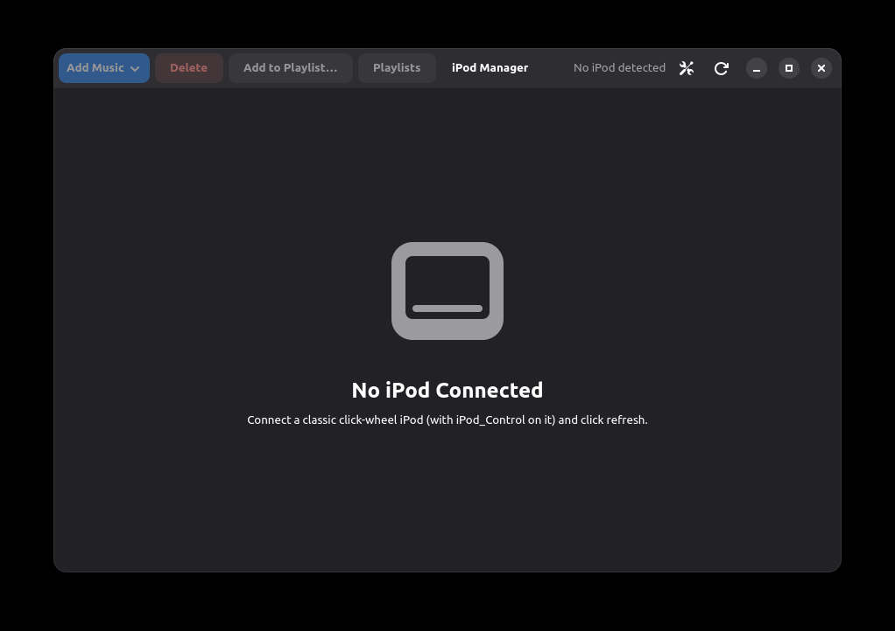
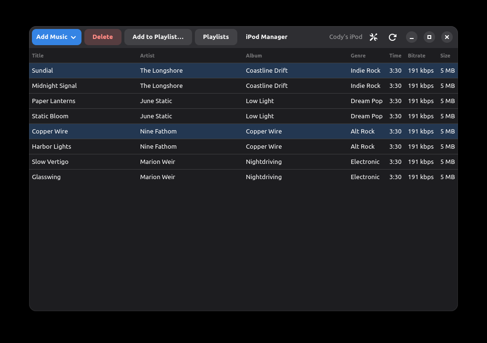

# iPod Manager

A GTK4/libadwaita app to browse, upload, and delete music on classic
click-wheel iPods — and, with real caveats documented below, iPhone/iPod
Touch-generation devices — without iTunes.

It reimplements the iPod's `iTunesDB` binary format from scratch in pure
Python (no `libgpod` dependency). FLAC files are automatically transcoded
to ALAC on import, since no iPod firmware can actually decode FLAC.

<p align="center">
  
  
</p>
<p align="center">
  
  
</p>

<details>
<summary>More screenshots (empty state, multi-select)</summary>
<br>
<p align="center">
  
  
</p>
</details>

## Status

| Device generation | Status |
| --- | --- |
| Classic click-wheel iPod (iPod Video 5/5.5G, etc.) | ✅ Fully working, verified against real hardware |
| Classic iPod cover art (`ArtworkDB`) | ⚠️ Implemented, **not yet verified against real hardware** |
| iPhone 3G / iPod Touch-generation | ⚠️ Partially working — imported tracks don't yet appear in the device's own Music app |

### Fully working — classic click-wheel iPods

- Detect a connected classic iPod (anything with `iPod_Control` on it),
  mounted as a plain USB drive
- List existing tracks with title/artist/album/genre/duration/bitrate/size
- Import FLAC or ALAC/AAC (`.m4a`/`.mp4`/`.m4b`) files, or a whole folder
  recursively, with automatic FLAC → ALAC transcoding (via ffmpeg) so the
  device can actually play them — with a live progress bar (percentage,
  file count, current file/stage)
- Import an `.m3u`/`.m3u8` playlist: every audio file it references gets
  imported (if not already present) and a real on-device playlist is
  created (or reused, if one with that name already exists) containing
  them
- Rename or delete a playlist, and add/remove individual tracks to/from
  one — deleting a playlist only removes the playlist itself, never its
  member tracks or their files
- Right-click context menus on both the track list and the Playlists view
  — Track Info, Add to Playlist, Remove from Playlist, Delete on tracks;
  Open, Rename, Delete on playlists — as a faster alternative to the
  toolbar buttons
- Optional "convert to AAC 320" setting (Preferences): when on, anything
  better than AAC 320kbps (lossless FLAC/ALAC, or lossy sources above
  320kbps) is re-encoded down to AAC 320kbps on import instead of kept
  losslessly, to save space; anything already at or below that quality is
  always left unchanged. Off by default.
- Delete tracks (removes the file and its database entry, and scrubs it
  from playlist membership so nothing points at a deleted track)
- Every write to `iTunesDB` is preceded by a timestamped backup under
  `iPod_Control/iTunes/.ipodmanager_backups/`
- Detects (and warns about) stale track references left behind in any
  `iTunesDB` section this app doesn't fully parse, instead of silently
  claiming full cleanup

### Implemented but unverified — classic iPod album art

Song/album cover art embedded in an imported file's tags is written to
the device's `ArtworkDB` + `.ithmb` thumbnail files, matching the iPod
Video generation's on-device format, so it should show up in the
device's own now-playing/Cover Flow UI. This was built the same way as
the rest of the classic-iPod code (transliterated from libgpod's actual
C source, not guessed) and is covered by structural unit tests, but
**has not been confirmed against a real iPod** — the author doesn't own
one. See [`docs/HARDWARE_FINDINGS.md`](docs/HARDWARE_FINDINGS.md) for
exactly what's proven vs. unverified, before relying on it — back up
`iPod_Control` first.

("Playlist art" in this app's own Playlists view is a separate,
lower-risk thing: just a thumbnail read from the first member track's
tags, shown only in this app's UI — classic click-wheel firmware has no
native concept of a playlist thumbnail, so nothing is written to the
device for this part.)

### Partially working — iPhone 3G / iPod Touch-generation devices

- Detection and mounting over USB via `usbmuxd`/lockdown/AFC
  (`pymobiledevice3`) — no jailbreak or WiFi required, works over the USB
  cable directly
- The classic-format layer (`iTunesCDB`, hash72-signed) is **fully
  working and verified against real hardware**: writes are
  cryptographically correct and durable across reboots
- **Tracks added this way do not appear in the device's own Music app.**
  This is fully diagnosed but not solved — see
  [`docs/HARDWARE_FINDINGS.md`](docs/HARDWARE_FINDINGS.md) for the full
  investigation
- **Fixed:** playlists not showing up in this app's own Playlists view on
  some real devices, where the playlist list lives at a non-standard
  `mhsd` index. The parser now identifies sections by their inner
  container's magic instead of trusting a fixed index. If playlists still
  don't show up, or tracks/playlists go missing, run the read-only
  diagnostic below against the device before assuming it's a new bug:

  ```
  python -m ipodmanager.diagnose
  ```

  With the device connected over USB (and the app itself closed), this
  mounts it read-only and reports what it finds, including each
  playlist's title, master/regular flag, and track count. Share that
  output rather than the file itself (it's your real library's metadata).

### Not yet implemented

- iPod 3G artwork: it has no color screen, so `ArtworkDB` writing is only
  ever attempted for the iPod Video 5/5.5G generation this app targets.
- Any `iTunesDB` section this app doesn't understand (album/artist browse
  indices, Genius data, real iTunes's podcast-playlist duplicate, etc.)
  is preserved byte-for-byte on write, not regenerated.

## Setup

```
sudo apt install gir1.2-gtk-4.0 gir1.2-adw-1 ffmpeg
pip install -e .
```

(`pip install -e .` pulls in Pillow, used to scale and pack cover art into
the on-device `ArtworkDB` thumbnail format.)

Run it:

```
python -m ipodmanager.ui.app
```

Run the test suite (covers the binary format parser/writer with synthetic
round-trip tests, the `ArtworkDB`/`.ithmb` chunk structure, the hash72
crypto, the SQLite mirror writer, and a full import→save→reload→delete→
save→reload cycle — including batch/folder/M3U-playlist imports and the
AAC-320 quality setting — against a fake device directory on disk):

```
pip install pytest
pytest
```

### iPhone-generation devices: extra setup

Talking to an iPhone/iPod Touch needs `pymobiledevice3`, which is kept in
a project-local virtualenv (`.venv`, created with `--system-site-packages`
so it can still see the system PyGObject/GTK install) rather than your
global Python environment — installing it globally previously caused a
version conflict with an unrelated tool on the dev machine this was built
on. To work on that code path:

```
python3 -m venv .venv --system-site-packages
source .venv/bin/activate
pip install pymobiledevice3
```

## How it's built

- **`ipodmanager/db/itunesdb.py`** — the classic binary format layer.
  Existing tracks and playlists are kept as opaque byte blobs and copied
  through unmodified unless directly touched; only newly added tracks are
  freshly synthesized, and only playlists referencing a deleted track are
  patched. This means an existing, working library round-trips
  byte-for-byte identical except for what you actually changed —
  deliberately the safest possible design against a real music
  collection. Every chunk offset was verified against
  [libgpod](https://github.com/fadingred/libgpod)'s actual source
  (`src/db-itunes-parser.h`, `src/itdb_itunesdb.c`, GNU LGPL-2.1+) rather
  than reconstructed from memory. Also handles the zlib-compressed body
  variant of this same format used by iPhone-generation devices.
  `has_stale_raw_reference()`/`raw_section_references_track()` give a
  read-only, best-effort way to detect (not fix) a deleted track still
  referenced inside a section this app doesn't parse, without needing to
  understand that section's full layout.
- **`ipodmanager/db/artworkdb.py`** — writes the classic iPod's `ArtworkDB`
  + `.ithmb` thumbnail files (cover art). Same "transliterated from
  libgpod's actual C source, not reconstructed from memory" standard as
  `itunesdb.py`, but unlike that module, **not yet confirmed against real
  hardware** — see [`docs/HARDWARE_FINDINGS.md`](docs/HARDWARE_FINDINGS.md).
  Always rebuilds from scratch (re-reading every track's on-device file's
  tags) rather than incrementally merging with whatever's already there,
  which keeps the write path simple at the cost of a bit of extra I/O per
  sync.
- **`ipodmanager/db/hash72.py`** — the cryptographic signature
  iPhone/Touch/Nano-3G+-generation devices require over the classic
  format before they'll accept it. AES-128-CBC with a fixed key; ported
  from libgpod's `itdb_hash72.c` and verified byte-exact against real
  hardware. Works by *extracting* a secret from a hash already on the
  device (put there by a real iTunes or libgpod sync) and reusing it —
  there's no way to derive a fresh one from nothing.
- **`ipodmanager/db/sqlite_library.py`** — mirrors track add/remove into
  the iPhone-generation `Library.itdb`/`Locations.itdb` SQLite bundle.
  The schema and its triggers were reverse-engineered against a real
  device's actual database (not guessed); see
  [`docs/HARDWARE_FINDINGS.md`](docs/HARDWARE_FINDINGS.md) for why this
  alone isn't enough to make new tracks show up in the Music app.
- **`ipodmanager/audio/`** — `inspect.py` reads tags/artwork via `mutagen`;
  `transcode.py` shells out to `ffmpeg` for FLAC → ALAC and, when the
  quality setting is on, anything → AAC 320.
- **`ipodmanager/transport/`** — device detection. `classic.py` finds a
  mounted classic iPod via `Gio.VolumeMonitor`. `iphone.py` connects over
  USB via `pymobiledevice3`/AFC, no mount or jailbreak needed.
- **`ipodmanager/settings.py`** — the one persisted app setting (convert-
  to-AAC-320), a small JSON file under the user's config dir. Not
  GSettings — that needs a compiled/installed schema, overkill for one
  boolean.
- **`ipodmanager/library.py`** — orchestrates device + database +
  filesystem: importing (with transcode when needed, singly, as a batch,
  or from an M3U playlist, all with progress reporting), rebuilding
  `ArtworkDB`, deleting, backup, and safe writes (write to a temp file,
  then atomic rename).
- **`ipodmanager/ui/`** — the GTK4 + libadwaita interface.

For the full, real-hardware-tested investigation behind the iPhone- and
ArtworkDB-support caveats above — what's proven, what's not, and what to
check first if you pick either back up — see
[`docs/HARDWARE_FINDINGS.md`](docs/HARDWARE_FINDINGS.md).

## License

[GPL-3.0-or-later](LICENSE)
